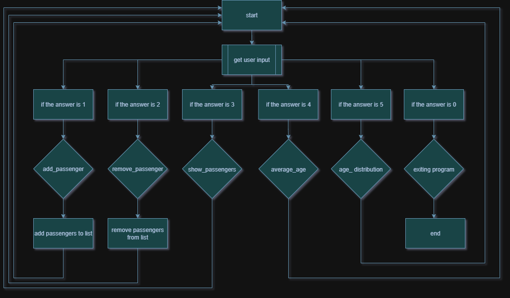

# Python-bus
A bus simulator written in Python.



## About

**Purpose:**
This was a group project assigned by our teacher.

The purpose was to learn how to collaborate with git and github  
we learned how to write modular code and use external libraries.

**Course / Assignment:**

Each student had to individually do the following:  
- Variables and data types
- Conditions (if/elif/else)
- Loops (for/while)
- At least one function
- At least one class (can be part of the larger project's OOP structure)

The project as a whole had to include the following:  
- Classes (OOP) – at least one class used in the project.
- Modules – the project should be divided into several files/modules.
- Standard libraries – at least two parts should be used (e.g. datetime, os, json, random).
- External libraries – at least one library/framework outside the standard library (e.g. requests, Flask, matplotlib).
- Version control (Git/GitHub) – the entire group should actively use GitHub for version control.
- Documentation – README with:
- Short description of the project
- Instructions for installation and execution
- Who made which file
- Testing – at least one unit test with PyTest.

**Technologies Used:**
- Python 3 - main programming language.
- os - used for file operations
- json - used for storing data
- datetime - used for handling and formatting dates and times.
- matplotlib - used for creating visualizations and plots.
- pytest - used for writing and running tests.

**Learnings:**

In this project we learned how to:  
- Plan and organize togheter as a team
- Improved git skills from terminal
- Solve git conflicts
- Contribute with modular code as an individual in a larger project

## Installation

1. Clone the repository:
```
git clone https://github.com/erikcoderman/python-bus.git
cd python-bus
```

2. Create and activate a virtual environment  

Windows:
```
python -m venv venv
venv\Scripts\activate
```

macOS / Linux:  
```
python3 -m venv venv
source venv/bin/activate
```

3. Install dependencies:
```
pip install -r requirements.txt
```

## Usage
Run the project:
```
python3 main.py
```

## Collaborators and Contributions
- **Asad** — GitHub: [@Asad8687](https://github.com/Asad8687)  
  - `main.py`  
  - `age_distribution.py`  
  - `add_passenger.py`  
  - `test_add_passenger.py`

- **Erik** — GitHub: [@erikcoderman](https://github.com/erikcoderman)  
  - `main.py`  
  - `age_distribution.py`  
  - `remove_passenger.py`  
  - `test_remove_passenger.py`  
  - `test_age_distribution.py`

- **David** — GitHub: [@davidfjellstrom](https://github.com/davidfjellstrom)  
  - `main.py`  
  - `age_distribution.py`  
  - `average_age.py`  
  - `test_average_age.py`

- **Gabriella** — GitHub: [@gcrossie](https://github.com/gcrossie)  
  - `main.py`  
  - `age_distribution.py`  
  - `show_passengers.py`  
  - `test_show_passengers.py`
